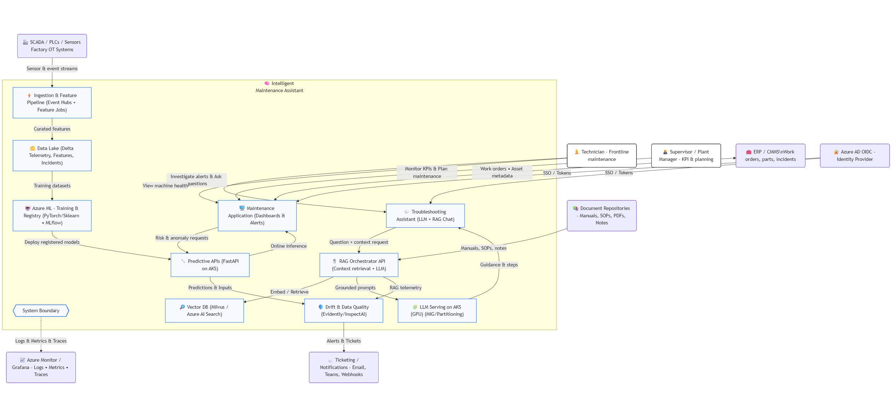
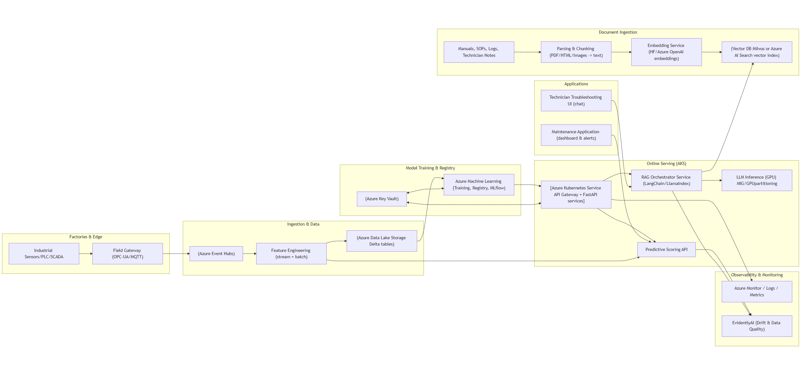

# Edge & Factory Floor Layer
Machines emit telemetry through sensors connected to PLCs and SCADA systems — vibration, temperature, pressure, RPM, energy consumption, and event logs.
Because these systems speak industrial protocols like OPC‑UA and MQTT, we use a field gateway that standardizes, batches, and secures data before sending it to the cloud.

Components:
- Industrial sensors / PLCs / SCADA
- Edge gateway agents
- Local TSDB (optional)
- On-prem buffering (intermittent connectivity)
- OPC-UA/MQTT connectors

Responsibilities:
- Collect raw sensor data
- Convert proprietary protocols → usable formats
- Send data securely to the cloud
- Support offline inference if needed (edge container)

# Ingestion & Streaming Layer
Telemetry goes into Azure Event Hubs, which acts as a horizontally scalable ingestion backbone. Event Hubs gives high-throughput ingestion, ordered partitions, and integration with both streaming and batch processors. This lets handle real-time anomaly detection as well as offline feature creation.

Components:
- Event Hubs / Kafka clusters
- Batch ingestion jobs (ERP/CMMS)
- File ingestion pipelines (manuals, logs, PDFs)
- Schema registry

Responsibilities:
- Real-time streaming data ingestion
- Standardize payloads
- Transport data to the data lake & feature pipelines
- Enforce schema contracts

# Feature Engineering & Orchestration Layer
Once data lands in Event Hubs, it flows into a hybrid feature‑engineering pipeline. Stream processors (like Azure Functions or a Spark/Kafka consumer) compute online features — rolling statistics, RMS vibration, frequency-domain transforms like FFT, recent deltas, and alarm checks.

Batch jobs orchestrated by Airflow or Dagster perform deeper transformations: joining telemetry with maintenance logs, normalizing sensor scales, performing window joins, filling missing data, and writing curated Delta tables in the Data Lake.

Components:
- Airflow / Dagster orchestrator
- Feature store (training + inference features)
- Data quality checks (Great Expectations)

Responsibilities:
- Batch and streaming feature pipelines
- Unified feature definitions
- Automated validation & data drift detection
- Trigger model training & retraining pipelines

# Data Lake & Storage Layer
The Data Lake is organized in bronze, silver, gold layers to differentiate raw (bronze), enriched (silver) and ready for training (gold).

Components:
- ADLS (raw → bronze → silver → gold)
- Blob storage (manuals, images, model artifacts)
- SQL/Postgres for metadata
- Time-series store

Responsibilities:
- Store raw and processed data
- Provide versioned datasets for ML
- Persist documents used for RAG
- Store application persistent state

# ML Training & Model Registry Layer
The ML pipeline uses Azure Machine Learning for model training. MLflow inside Azure ML to track experiments, metrics, parameters, and lineage.

Models — typically anomaly detectors, binary classifiers predicting machine failure risk, or regression models predicting remaining useful life — are trained on the curated Delta datasets.

Results get versioned in the model registry. When a model is promoted to the ‘production’ stage, Azure ML triggers a deployment pipeline that builds a container image and deploys the model as a FastAPI microservice in AKS.

Access to model artifacts, vector DB credentials, and storage keys is secured via Azure Key Vault using managed identities.

Components:
- Azure Machine Learning workspace
- Compute clusters for training
- MLflow (experiment tracking + registry)

Responsibilities:
- Train predictive models (PyTorch, Scikit-learn)
- Tune hyperparameters
- Track metrics, artifacts, parameters
- Register versioned models for deployment

# Deployment & Orchestration Layer (Runtime)
At runtime, AKS hosts a predictive scoring API built with FastAPI. When the maintenance application calls /predict, the service fetches recent features from the feature store, loads the corresponding model version, executes inference, applies business rules like thresholds or confidence checks, and returns a labeled prediction.

AKS gives us auto-scaling, node pools for separation of CPU vs GPU workloads, health probes, zero-downtime rollouts, and canary deployments for safe model updates.

The scoring API logs structured telemetry — latency, inputs, outputs, model version — which flows into Azure Monitor and goes to the drift monitor.

- AKS (Azure Kubernetes Service)
- Node pools (CPU, GPU)
- Autoscalers
- API Gateway / Ingress Controller
- Service Mesh

Responsibilities:
- Host microservices & model servers
- Manage scaling & resiliency
- Secure service-to-service networking
- Expose stable production endpoints

# Inference & Serving Layer
Components:
- FastAPI microservices:
- - Predictive maintenance scoring API
- - Anomaly detection API
- - LLM troubleshooting assistant API
- - Incident similarity search API
- Container images (Docker)
- GPU partitioning (MIG or similar)

Responsibilities:
- Serve ML predictions in real time
- Provide LLM responses
- Handle traffic from UI or ERP systems
- Provide consistent latency in production

# LLM & RAG Layer
The second major part of the platform is the troubleshooting LLM.

A document ingestion and embedding pipeline to support retrieval‑augmented generation (RAG).

Manuals, SOPs, incident reports, and technician notes are ingested through an orchestrated pipeline that parses documents (PDF/HTML/Markdown), runs OCR where needed, performs chunking with overlap, enriches with metadata like asset type or component, and generates vector embeddings using an embedding service.

These embeddings are stored in a vector database such as Milvus or Azure AI Search with vector indexing enabled.
This allows efficient kNN searches when the technician asks a question.

The Troubleshooting Assistant is exposed through a FastAPI‑based RAG Orchestrator running on AKS.
When a technician asks a question like ‘Motor overheating with vibration spikes — what should I inspect first?’, the service performs several steps:

1. Retrieve: The service uses semantic search in the vector DB to retrieve the most relevant technical chunks.
2. Rerank: Optionally reranks them using a cross‑encoder for accuracy.
3. Prompt Building: Constructs a grounded prompt that includes instructions, retrieved documents, domain constraints, safety rules, and expected answer format (usually step‑by‑step).
4. Guardrails: Applies safety and compliance checks — PII filtering, hallucination prevention, forbidden actions, factual consistency checks.
5. LLM Inference: Sends the structured prompt to an LLM service running on AKS GPU nodes. We use MIG partitioning to efficiently share GPU resources.
6. Formatting & Return: Returns a final structured response with steps and citations pointing back to source documents in the vector DB.

This ensures answers are grounded, explainable, and traceable — a key industrial requirement.

Components:
- Document loaders / chunkers
- Embedding models (HF/Azure OpenAI)
- Vector database (Milvus / OpenSearch)
- LangChain / LlamaIndex runtime
- LoRA/QLoRA fine-tuning pipelines
- Evaluation (InspectAI / DeepEval)

Responsibilities:
- Ingest & index manuals, notes, logs
- Retrieve relevant context for technician queries
- Power the troubleshooting assistant
- Fine-tune or adapt models with domain data

# Observability & Monitoring Layer
Both the predictive API and the RAG orchestrator emit minimal telemetry to a centralized drift and data‑quality monitor built using Evidently. This service monitors feature distributions, model score distributions, retrieval hit rates, and response quality markers like hallucination flags.

When drift crosses thresholds — for example, vibration levels shifting due to new operating regimes — alerts are sent to Azure Monitor, and optionally a retraining pipeline is triggered. The retraining pipeline in Azure ML uses the latest Delta tables, retrains or fine‑tunes models, evaluates them automatically, and then pushes new candidates into the model registry for controlled rollout.

Components:
- Logging (OpenTelemetry / ELK / Azure Monitor)
- Metrics & dashboards (Grafana / Azure Monitor)
- Alerts
- Model drift detection (EvidentlyAI / custom)
- LLM evaluation feedback loops

Responsibilities:
- Monitor service health
- Track model performance degradation
- Detect input drift, data quality issues
- Capture technician feedback on LLM responses

# Security & Compliance Layer
The entire system is identity‑driven via Azure AD. Technicians, supervisors, and services authenticate via OAuth2 tokens, and access is controlled by scopes and RBAC roles.

*All traffic to AKS runs through an API gateway with TLS termination, private networking, and minimal public exposure.

It maintains full auditability — every prediction, retrieved document, and LLM answer is tied to a trace ID, model version, and request ID.”

Components:
- Azure AD (OIDC authentication)
- RBAC for APIs & dashboards
- Key Vault for secrets
- Private VNETs & Private Endpoints
- Image scanning + SBOM

Responsibilities:
- Authenticate/authorize users
- Protect secrets and credentials
- Ensure data governance & compliance
- Provide secure, isolated workloads

# Application & UX Layer
- Technician web UI
- Supervisor dashboards
- Mobile app (optional)
- Integration with ERP/CMMS (SAP, Maximo)

Responsibilities:
- Alert technicians about upcoming failures
- Allow natural-language troubleshooting
- Provide historical trends & machine health
- Embed into existing enterprise systems

# CI/CD & DevOps Layer
- GitHub Actions workflows (build/test/deploy)
- Infrastructure-as-Code (Bicep/Terraform)
- Container registry (ACR)
- Environment promotion gates

Responsibilities:
- Build and test all microservices
- Deploy containers to AKS
- Register + promote ML models
- Test data pipelines

3. Feature Engineering & Data Lake
“Once data lands in Event Hubs, it flows into a hybrid feature‑engineering pipeline. Stream processors (like Azure Functions or a Spark/Kafka consumer) compute online features — rolling statistics, RMS vibration, frequency-domain transforms like FFT, recent deltas, and alarm checks.”
“Batch jobs orchestrated by Airflow or Dagster perform deeper transformations: joining telemetry with maintenance logs, normalizing sensor scales, performing window joins, filling missing data, and writing curated Delta tables in the Data Lake.
The Data Lake is organized in bronze, silver, gold layers so we always know what’s raw vs. enriched vs. ready for training.”

4. ML Training, Model Registry, & Deployment
“The ML pipeline uses Azure Machine Learning for model training. We leverage MLflow inside Azure ML to track experiments, metrics, parameters, and lineage.
Models — typically anomaly detectors, binary classifiers predicting machine failure risk, or regression models predicting remaining useful life — are trained on the curated Delta datasets.”
“Results get versioned in the model registry. When a model is promoted to the ‘production’ stage, Azure ML triggers a deployment pipeline that builds a container image and deploys the model as a FastAPI microservice in AKS.”
“Access to model artifacts, vector DB credentials, and storage keys is secured via Azure Key Vault using managed identities.”

5. Inference Layer (AKS) — Real-Time Predictive Scoring
“At runtime, AKS hosts a predictive scoring API built with FastAPI. When the maintenance application calls /predict, the service fetches recent features from the feature store, loads the corresponding model version, executes inference, applies business rules like thresholds or confidence checks, and returns a labeled prediction.”
“AKS gives us auto-scaling, node pools for separation of CPU vs GPU workloads, health probes, zero-downtime rollouts, and canary deployments for safe model updates.
The scoring API logs structured telemetry — latency, inputs, outputs, model version — which flows into Azure Monitor and goes to the drift monitor.”

6. Document Processing & Vector Database
“The second major part of the platform is the troubleshooting LLM.
To support retrieval‑augmented generation (RAG), we maintain a document ingestion and embedding pipeline.”
“Manuals, SOPs, incident reports, and technician notes are ingested through an orchestrated pipeline that parses documents (PDF/HTML/Markdown), runs OCR where needed, performs chunking with overlap, enriches with metadata like asset type or component, and generates vector embeddings using an embedding service.”
“These embeddings are stored in a vector database such as Milvus or Azure AI Search with vector indexing enabled.
This allows efficient kNN searches when the technician asks a question.”

7. RAG Orchestration & LLM Inference
“The Troubleshooting Assistant is exposed through a FastAPI‑based RAG Orchestrator running on AKS.
When a technician asks a question like ‘Motor overheating with vibration spikes — what should I inspect first?’, the service performs several steps:”
1️⃣ Retrieve: The service uses semantic search in the vector DB to retrieve the most relevant technical chunks.
2️⃣ Rerank: Optionally reranks them using a cross‑encoder for accuracy.
3️⃣ Prompt Building: Constructs a grounded prompt that includes instructions, retrieved documents, domain constraints, safety rules, and expected answer format (usually step‑by‑step).
4️⃣ Guardrails: Applies safety and compliance checks — PII filtering, hallucination prevention, forbidden actions, factual consistency checks.
5️⃣ LLM Inference: Sends the structured prompt to an LLM service running on AKS GPU nodes. We use MIG partitioning to efficiently share GPU resources.
6️⃣ Formatting & Return: Returns a final structured response with steps and citations pointing back to source documents in the vector DB.
“This ensures answers are grounded, explainable, and traceable — a key industrial requirement.”

8. Monitoring, Drift Detection, and Continuous Retraining
“Both the predictive API and the RAG orchestrator emit minimal telemetry to a centralized drift and data‑quality monitor built using Evidently.
This service monitors feature distributions, model score distributions, retrieval hit rates, and response quality markers like hallucination flags.”
“When drift crosses thresholds — for example, vibration levels shifting due to new operating regimes — alerts are sent to Azure Monitor, and optionally a retraining pipeline is triggered.”
“The retraining pipeline in Azure ML uses the latest Delta tables, retrains or fine‑tunes models, evaluates them automatically, and then pushes new candidates into the model registry for controlled rollout.”

9. Security & Governance
“The entire system is identity‑driven via Azure AD.
Technicians, supervisors, and services authenticate via OAuth2 tokens, and access is controlled by scopes and RBAC roles.”
*“All traffic to AKS runs through an API gateway with TLS termination, private networking, and minimal public exposure.”
We also maintain full auditability — every prediction, retrieved document, and LLM answer is tied to a trace ID, model version, and request ID.”